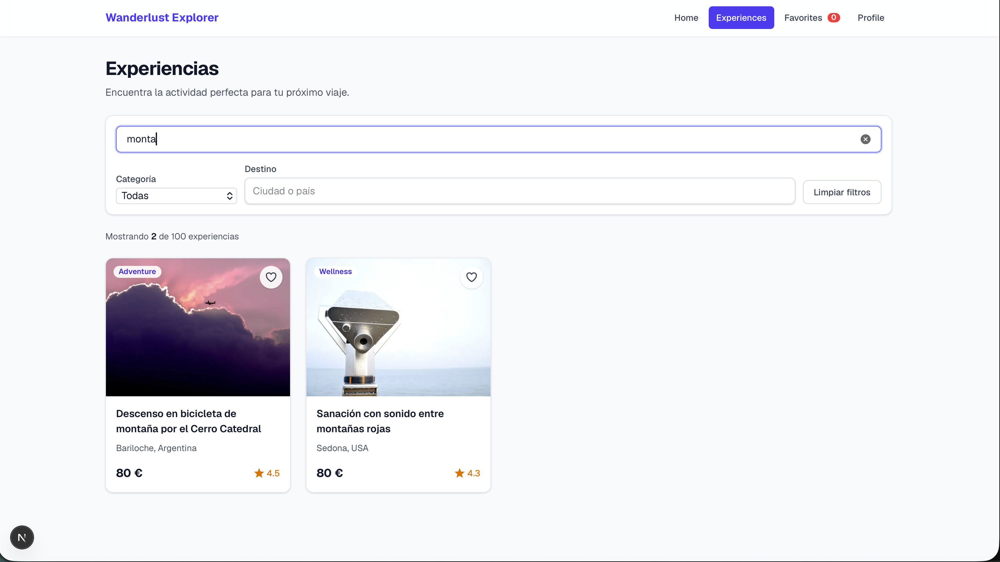
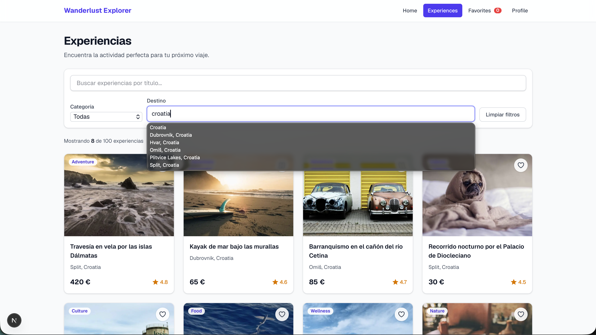
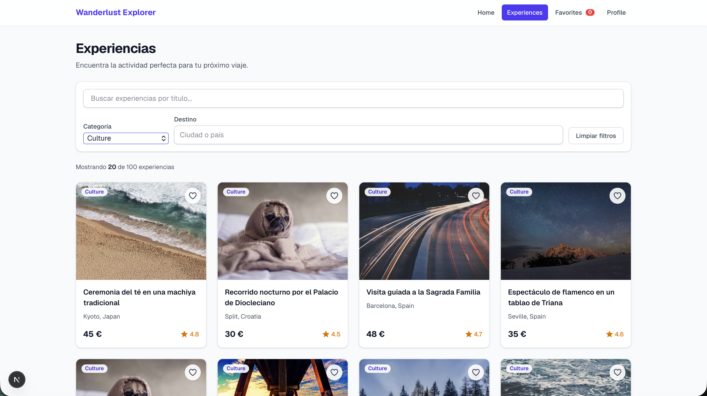

# Wanderlust Explorer

Aplicación web para descubrir experiencias de viaje únicas en todo el mundo. Permite explorar un catálogo de 100 experiencias (aventura, cultura, gastronomía, bienestar y naturaleza), buscarlas por título, filtrarlas por categoría y destino, ver su detalle y guardarlas como favoritas.

Live demo: https://hnandrade-nextjs-wanderlust-explore.vercel.app

## Stack

- [Next.js 16](https://nextjs.org) (App Router, Turbopack)
- React 19 + TypeScript (modo estricto)
- Tailwind CSS 4
- `next/image`, `next/link` y `next/navigation` (`useSearchParams`, `usePathname`, `useRouter`)
- ESLint (`eslint-config-next`)
- Sin librerías externas de estado: solo `useState` y React Context

## Cómo ejecutarlo

```bash
npm install
npm run dev
```

Abre [http://localhost:3000](http://localhost:3000).

Otros scripts:

```bash
npm run lint   # ESLint
npm run build  # build de producción
npm run start  # sirve el build de producción
```

## Estructura de carpetas

```
src/
├── app/
│   ├── layout.tsx                 # Layout raíz: FavoritesProvider + Navbar
│   ├── page.tsx                   # Home (hero)
│   ├── globals.css
│   ├── experiences/
│   │   ├── page.tsx               # Listado con búsqueda y filtros (Suspense)
│   │   └── [id]/
│   │       ├── page.tsx           # Detalle (server component)
│   │       └── not-found.tsx      # 404 amigable
│   ├── favorites/page.tsx         # Favoritos
│   └── profile/page.tsx           # Perfil simulado
├── components/
│   ├── Navbar.tsx                 # Navegación con enlace activo y badge de favoritos
│   ├── SearchBar.tsx              # Búsqueda por título con debounce
│   ├── FilterBar.tsx              # Filtros de categoría y destino
│   ├── ExperienceCard.tsx         # Tarjeta de experiencia
│   ├── ExperienceGrid.tsx         # Cuadrícula responsiva + estado vacío
│   ├── ExperiencesExplorer.tsx    # Contenedor cliente de /experiences
│   ├── HeartButton.tsx            # Botón corazón (presentacional)
│   ├── FavoriteButton.tsx         # Corazón conectado a favoritos (detalle)
│   ├── FavoritesList.tsx          # Contenedor cliente de /favorites
│   ├── FavoritesProvider.tsx      # Estado de favoritos de nivel superior
│   ├── ProfileSummary.tsx         # Resumen de favoritos en /profile
│   └── DocumentTitle.tsx          # Actualiza document.title
├── hooks/
│   ├── useFilters.ts              # Lógica de búsqueda/filtros sincronizada con la URL
│   └── useFavorites.ts            # Acceso a favoritos
├── data/
│   └── experiences.ts             # 100 experiencias + CATEGORIES
└── types/
    └── experience.ts              # Tipos Category y Experience
```

## Páginas y rutas

| Ruta | Descripción |
| --- | --- |
| `/` | Home con hero y enlace "Explorar experiencias". |
| `/experiences` | Cuadrícula con las 100 experiencias, barra de búsqueda, filtros y contador de resultados. |
| `/experiences/[id]` | Detalle de una experiencia (imagen, descripción, categoría, destino, precio, rating y favorito). Si el id no existe muestra una página 404. |
| `/favorites` | Solo las experiencias marcadas como favoritas, o un mensaje vacío con enlace al catálogo. |
| `/profile` | Perfil de usuario simulado con el número de favoritos guardados. |

Toda la navegación usa `next/link`, por lo que es del lado del cliente y sin recargas completas. La `Navbar` está en el layout raíz y resalta el enlace activo con `usePathname`.

## Filtros en la URL

La búsqueda y los filtros viven en los query params, de modo que cualquier combinación se puede compartir o recargar:

```
/experiences?search=vela&category=Adventure&destination=Croatia
```

- `useFilters` lee `search`, `category` y `destination` con `useSearchParams`.
- Al cambiar un valor se crea un `URLSearchParams` a partir de los actuales, se eliminan los vacíos y se llama a `` router.replace(`${pathname}?${params}`, { scroll: false }) ``, sin recargar la página.
- **Búsqueda**: filtra por título con `new RegExp(term, "i")`. Si el término no es una regex válida (por ejemplo `(`), se escapan los caracteres especiales.
- **Categoría**: igualdad exacta con una de las 5 categorías.
- **Destino**: coincidencia sin distinguir mayúsculas contra `destination` (`"Ciudad, País"`), por lo que sirve tanto la ciudad como el país.
- Los tres filtros son independientes y se combinan con AND. El resultado se memoiza con `useMemo`.
- `SearchBar` y `FilterBar` se prerrellenan desde la URL, sincronizan su estado local con `useEffect` (por ejemplo, al usar atrás/adelante) y aplican un debounce de 300 ms antes de actualizar la URL.
- Como `useSearchParams` lo requiere, `ExperiencesExplorer` se renderiza dentro de `<Suspense>`.

## Estado de favoritos

- `FavoritesProvider` contiene un `useState<number[]>([])` con los ids favoritos y `toggleFavorite(id)`. Está en `layout.tsx`, que persiste entre rutas, así que los favoritos se mantienen al navegar.
- El Context solo sirve para que páginas y contenedores (`ExperiencesExplorer`, `FavoritesList`, `FavoriteButton`, `ProfileSummary`, `Navbar`) lean ese estado mediante el hook `useFavorites`, que devuelve `{ favoriteIds, toggleFavorite, isFavorite }`.
- Los componentes de presentación (`ExperienceGrid`, `ExperienceCard`, `HeartButton`) reciben `favoriteIds`/`isFavorite` y `onToggleFavorite` por props.
- El corazón se muestra relleno y rojo cuando la experiencia es favorita y en contorno cuando no. Expone `aria-pressed` y no navega al pulsarlo dentro de una tarjeta.
- No hay persistencia (sin `localStorage`): los favoritos se pierden al recargar la página.

## Design References

1. **[Airbnb Experiences](https://www.airbnb.com/experiences)**: inspiró la cuadrícula de tarjetas con imagen grande, el botón de corazón superpuesto en la esquina y la información compacta (destino, precio y valoración).

   

2. **[GetYourGuide](https://www.getyourguide.com)**: inspiró la barra de búsqueda destacada sobre los resultados y el contador de actividades encontradas.

   

3. **[Viator](https://www.viator.com)**: inspiró la barra de filtros por categoría y destino, combinables con la búsqueda, y el botón para limpiar filtros.

   
